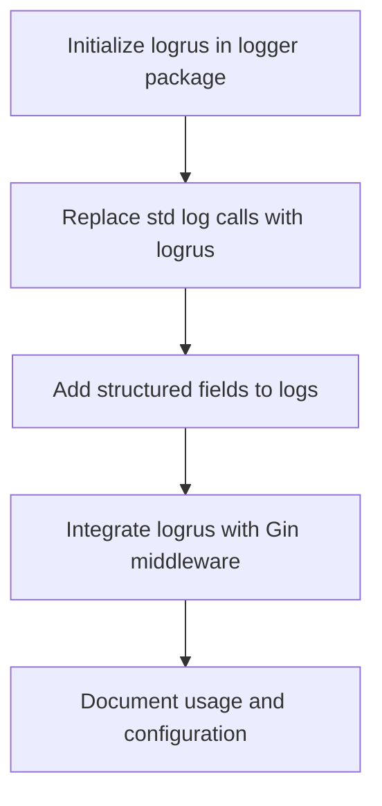

# Plan: Add Structured Logging with Logrus

## 1. Add logrus Dependency

- Add `github.com/sirupsen/logrus` to your `go.mod`.

## 2. Centralize Logger Initialization

- Create a `logger` package (e.g., [`internal/logger/logger.go`](internal/logger/logger.go:1)) to initialize and configure logrus (set log level, format, output).
- Allow log level and format (JSON/text) to be set via environment variables.

## 3. Refactor Logging Calls

- Replace all `log.Print*`, `log.Fatal*`, etc. with `logrus` equivalents:
  - `log.Info`, `log.Warn`, `log.Error`, `log.Fatal`, etc.
- Use structured fields for important context (e.g., errors, user IDs, request IDs).

## 4. Integrate Logger with Gin

- Use a logrus middleware for Gin to log HTTP requests and errors.

## 5. Documentation

- Document how to use the logger for new code and how to set log level/format.

---

