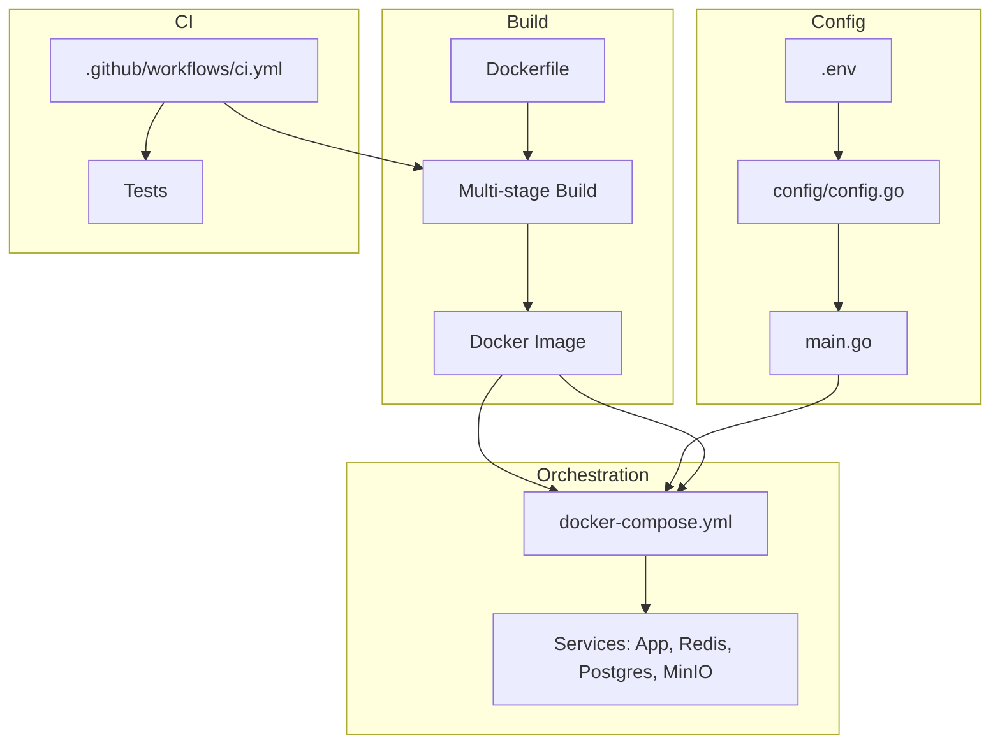

# Production Hardening Plan for go-video-concat

## 1. `config/config.go`

- Refactor to use ALL_CAPS env vars (e.g., DB_HOST, MINIO_USER).
- Remove godotenv; use only os.Getenv.
- Return a Config struct from LoadConfig() (no global pointer).
- Validate required vars and return errors if missing.

## 2. `main.go`

- Accept config as a return value.
- Bind Gin on 0.0.0.0:${PORT} (default 8080).
- Add GET /healthz endpoint returning 200 OK.
- Move GORM auto-migration into a CLI subcommand (stubbed).

## 3. `Dockerfile`

- Convert to a multi-stage build:
  - Builder: Go 1.20, install git/ffmpeg, build binary.
  - Final: Alpine, install ffmpeg/ca-certificates, copy binary, set entrypoint.

## 4. `docker-compose.yml`

- Add healthchecks for Postgres and Redis.
- Use depends_on with condition: service_healthy.
- Expose MinIO ports 9000/9001, add healthcheck.
- Attach all services to external inner network.
- Inject only ALL_CAPS env vars from .env (via env_file + environment).

## 5. `.env.example`

- Create a template listing all required ALL_CAPS variables with generic placeholders and comments.

## 6. `.github/workflows/ci.yml`

- On push/pull_request:
  - Checkout code.
  - Set up Go 1.20.
  - Run go fmt, go vet, go test ./...
  - Build Docker image (multi-stage).
  - Push to Docker Hub (stub credentials, only on main branch merges).

---

## Mermaid Diagram

---

**This plan is ready for implementation. Switch to code mode to proceed with the changes.**
